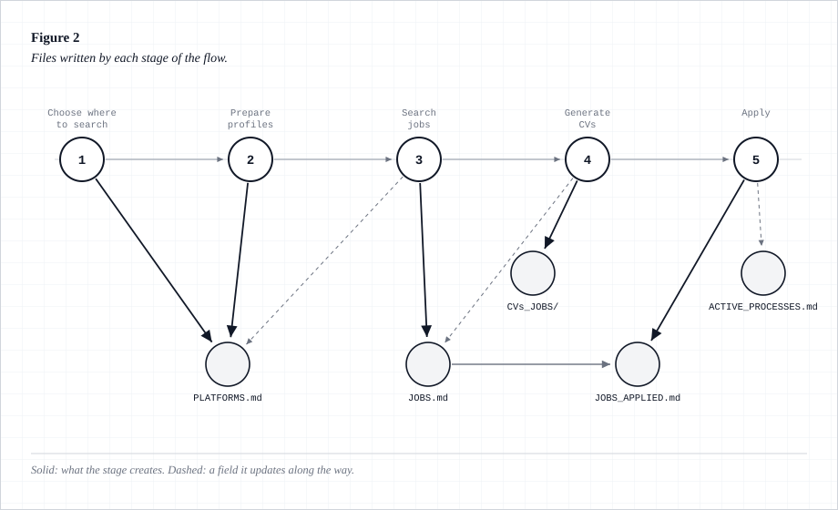
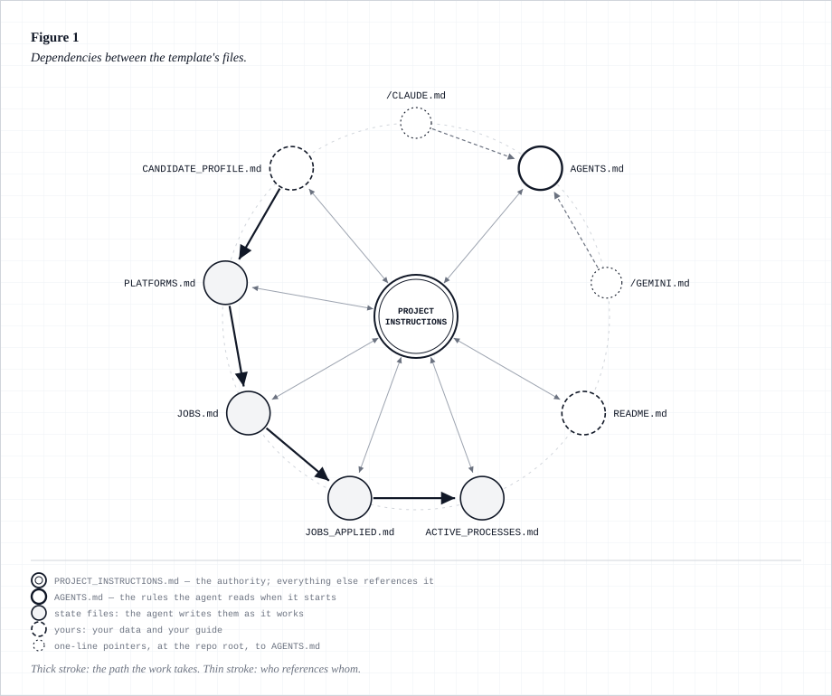

# Automated Job Search with an AI Agent
# Búsqueda de Empleo Automática con un Agente de IA

**A project template that lets any AI agent run your whole job search.** You drop in your CV
and your details once; from there it decides where to look, tunes your profiles, finds jobs
that actually fit, writes a tailored CV for each one and keeps track of every process. It is
not an app and there is nothing to install: it's a set of markdown files that tell the agent
how to behave.

**Una plantilla de proyecto para que cualquier agente de IA lleve tu búsqueda de empleo
entera.** Le das tu CV y tus datos una vez; a partir de ahí decide dónde buscar, te prepara los
perfiles, encuentra ofertas que encajen de verdad, redacta un CV a medida para cada una y lleva
el seguimiento de cada proceso. No es una aplicación ni hay nada que instalar: son archivos de
texto que le dicen al agente cómo comportarse.

---

## Start here · Empieza por aquí

Step by step, assuming you have never used GitHub. It takes about 15 minutes.
Paso a paso, sin dar por sabido nada de GitHub. Son unos 15 minutos.

| | Install · Instalar | What you need · Qué necesitas |
|---|---|---|
| 🇬🇧 | **[Installation guide →](en/INSTALL.md)** | [Requirements](en/REQUIREMENTS.md) |
| 🇪🇸 | **[Guía de instalación →](es/INSTALACION.md)** | [Requisitos](es/REQUISITOS.md) |

No CV yet? The project writes one with you — no need to bring one.
¿No tienes CV? El proyecto te lo hace: no hace falta que traigas nada.

---

## How it works · Cómo funciona

1. **Choose where to search** · **Elegir dónde buscar** — you name the sites you already use
   and it recommends others that fit your profile and your area.
2. **Prepare your profiles** *(optional)* · **Preparar los perfiles** *(opcional)* — it reviews
   LinkedIn, GitHub and the job boards against your data and proposes changes one by one.
3. **Search** · **Buscar** — it walks your platforms in priority order and records what fits.
4. **Generate CVs** · **Generar los CV** — one tailored CV per job, copying your own Word
   design and changing only the text.
5. **Apply** · **Aplicar** — it submits where it can and tracks the rest. This stage is
   optional: you can keep the applying to yourself.

Every stage writes to a plain text file you can read and correct at any point. Nothing happens
in a black box.

Cada etapa escribe en un archivo de texto que puedes leer y corregir cuando quieras. No hay
caja negra.

---

## How the pieces fit · Cómo encajan las piezas

The manual in the centre is the authority: it holds the rules the agent follows. Around it sit
the state files it maintains as it works — the platforms you approved, the jobs found, the
ones already applied to, and your open selection processes.

El manual del centro es la autoridad: contiene las reglas que sigue el agente. Alrededor están
los archivos de estado que él mantiene mientras trabaja: las plataformas que aprobaste, las
ofertas encontradas, las ya aplicadas y tus procesos de selección abiertos.

Figures in Spanish · Figuras en español: [`es/grafo_dependencias.md`](es/grafo_dependencias.md)
— full explanation in English: [`en/dependency_graph.md`](en/dependency_graph.md)

---

## Pick your language · Elige tu idioma

| | |
|---|---|
| 🇬🇧 **[English →](en/)** | The whole template in English: start with `en/README.md`. |
| 🇪🇸 **[Español →](es/)** | La plantilla entera en español: empieza por `es/README.md`. |

Each folder is **a complete, self-contained copy**. Copy the repository, open the folder in
your language and **delete the other one** — you only need one, and keeping a single copy means
the two can never drift apart on you.

Cada carpeta es **una copia completa y autónoma**. Copia el repositorio, abre la carpeta de tu
idioma y **borra la otra**: solo necesitas una, y así no se te desincronizan.

> The Spanish copy is the reference version. If the two ever disagree, `es/` wins.
> La versión de referencia es la española: si alguna vez discrepan, manda `es/`.

---

## What you need · Qué necesitas

An AI agent that can read and write files in the folder (Claude Code, Codex, Cursor, Gemini
CLI, Copilot…). To search and apply it also needs to browse the web; to build the CVs it needs
to run commands, with LibreOffice or Microsoft Word installed.

Un agente de IA que pueda leer y escribir archivos en la carpeta (Claude Code, Codex, Cursor,
Gemini CLI, Copilot…). Para buscar y aplicar necesita además navegar por internet; para generar
los CV, ejecutar comandos y tener LibreOffice o Microsoft Word instalado.

---

## Then just say · Y luego solo di

> **«Start the project»** · **«Inicia el proyecto»**

The agent interviews you, fills everything in and gets to work.
El agente te entrevista, lo rellena todo y se pone a trabajar.
