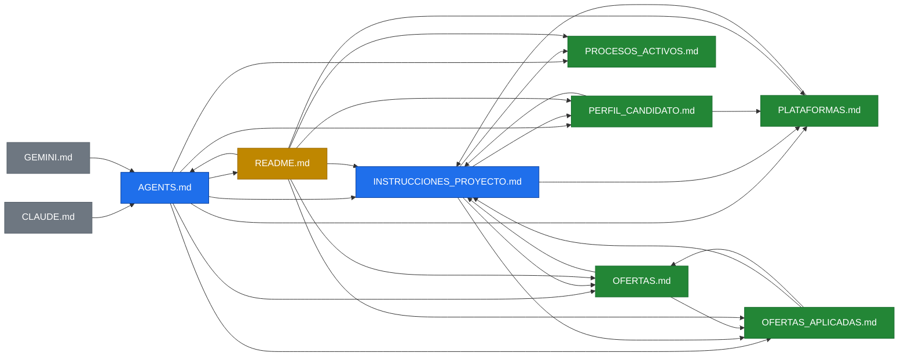
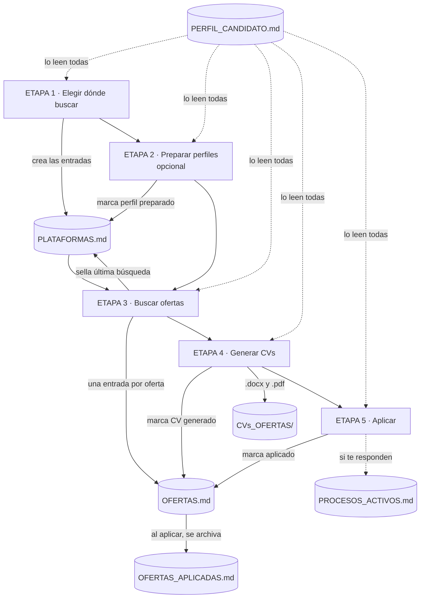

# Grafo de dependencias de los archivos

> Mapa de qué archivo manda sobre qué, quién lee a quién y qué escribe cada etapa del flujo.
> Útil para saber dónde tocar cuando quieras adaptar la plantilla, y para no acabar con la
> misma regla escrita en dos sitios.
>
> Los diagramas son Mermaid: GitHub los pinta al abrir este archivo.

## 1. Quién lee a quién

| Color | Qué es |
|---|---|
| 🔵 **Entrada** | Lo que el agente lee para saber cómo comportarse |
| ⚫ **Puntero** | Una línea que redirige a `AGENTS.md`, para las herramientas que buscan su propio nombre de archivo |
| 🟢 **Estado** | Cambia mientras se trabaja. Lo escribe el agente, no tú (salvo `PERFIL_CANDIDATO.md`) |
| 🟡 **Humano** | El README: para ti, no para el agente |

**La regla de oro del grafo:** `INSTRUCCIONES_PROYECTO.md` es la autoridad y `PERFIL_CANDIDATO.md`
la única fuente de los datos del candidato. Todo lo demás apunta a uno de los dos en vez de
repetir su contenido. Si añades una regla, ponla en un solo sitio y que el resto la referencie.

## 2. Qué escribe cada etapa

Las etapas 1 y 2 son la preparación: sin `PLATAFORMAS.md` no se busca, y la 2 es opcional.
De la 3 a la 5 es el ciclo que repites cada vez que quieras más ofertas.

## 3. Lo que no está en el grafo y necesitas igual

| Archivo | Lo pones tú | Para qué |
|---|---|---|
| `CV_GENERICO.docx` | Sí, al arrancar | La plantilla de CV que se copia y personaliza para cada oferta. Su diseño no se toca nunca |
| `foto_perfil_circular.png` | Sí, al arrancar | La foto del CV |
| `CVs_OFERTAS/` | Lo crea el agente | Donde acaban el `.docx` y el `.pdf` de cada oferta |

Los tres están en `.gitignore`: son tuyos y no deben acabar en un repositorio público.
