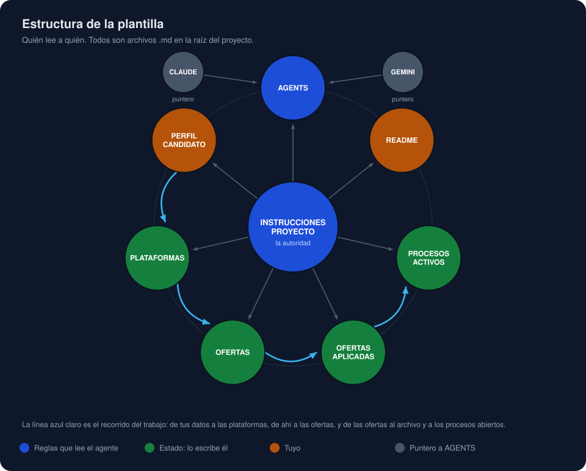
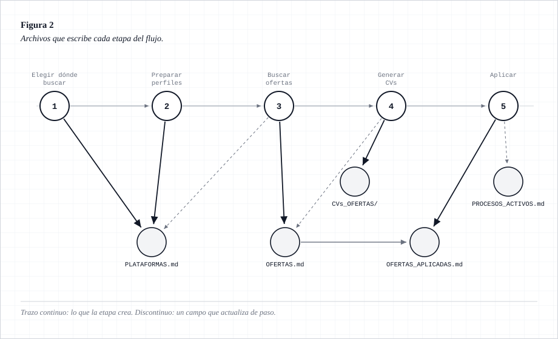

# Grafo de dependencias de los archivos

> Mapa de qué archivo manda sobre qué, quién lee a quién y qué escribe cada etapa del flujo.
> Útil para saber dónde tocar cuando quieras adaptar la plantilla, y para no acabar con la
> misma regla escrita en dos sitios.

## 1. Quién lee a quién

En el centro, `INSTRUCCIONES_PROYECTO.md`: es la autoridad y todos los demás apuntan a él en
vez de repetir su contenido. Alrededor, en verde, los archivos que el agente escribe solo
mientras trabaja. En ámbar los tuyos: `PERFIL_CANDIDATO.md`, que rellenas al empezar, y el
`README.md`, que es para ti y no para él. En gris, `CLAUDE.md` y `GEMINI.md`, que son una línea
cada uno redirigiendo a `AGENTS.md`, para que cada herramienta encuentre su nombre de archivo.

La línea azul claro es el recorrido del trabajo: de tus datos salen las plataformas, de las
plataformas las ofertas, y de las ofertas el archivo histórico y los procesos abiertos.

**La regla de oro:** `INSTRUCCIONES_PROYECTO.md` manda y `PERFIL_CANDIDATO.md` es la única
fuente de los datos del candidato. Si añades una regla, ponla en un solo sitio y que el resto
la referencie.

## 2. Qué escribe cada etapa

Las etapas 1 y 2 son la preparación: sin `PLATAFORMAS.md` no se busca, y la 2 es opcional.
De la 3 a la 5 está el ciclo que repites cada vez que quieras más ofertas. Las flechas
discontinuas son campos que una etapa actualiza de paso, como la fecha de última búsqueda.

## 3. Lo que no está en el repositorio y necesitas igual

| Archivo | Lo pones tú | Para qué |
|---|---|---|
| `CV_GENERICO.docx` | Sí, al arrancar | La plantilla de CV que se copia y personaliza para cada oferta. Su diseño no se toca nunca |
| `foto_perfil_circular.png` | Sí, al arrancar | La foto del CV |
| `CVs_OFERTAS/` | Lo crea el agente | Donde acaban el `.docx` y el `.pdf` de cada oferta |

Los tres están en `.gitignore`: son tuyos y no deben acabar en un repositorio público.

---

Los diagramas son SVG y se regeneran con el script que los dibuja, no a mano. Si cambias
la estructura de archivos, actualízalos.
